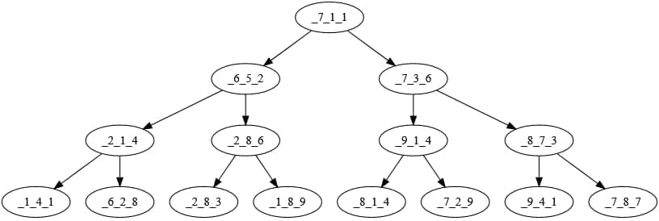

This repo is a place to collaborate on the K-D Tree project, for the course CSC212.

## Instruction

### Command to compile the source files:
g++ -std=c++17 main.cpp tree.cpp IO.cpp -o tree

### Running executable file
Each phrase in <> below is seperated with a space in terminal:

<"tree"> <your arbitrary number of points (number of nodes) > <your arbitrary dimensions (k)> <maximum values of each dimension (k times)>
  
### The following steps will be performed by executing the above line:
