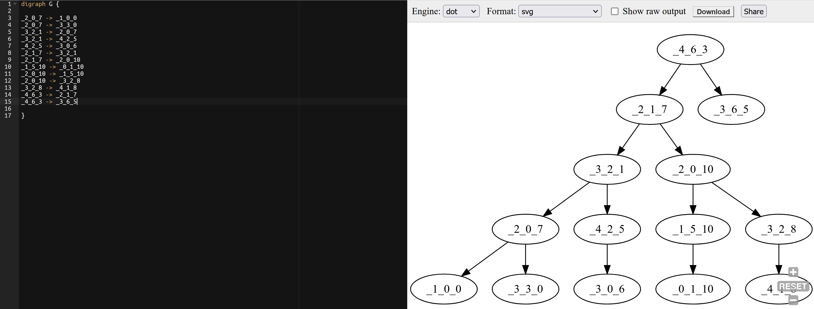

This repo is a place to collaborate on the K-D Tree project, for the course CSC212.

## Instruction

### Command to compile the source files:
g++ -std=c++17 main.cpp tree.cpp IO.cpp -o tree

### Running executable file
Each phrase in <> below is seperated with a space in terminal:

<"tree"> <_your arbitrary number of points_ > <_your arbitrary dimensions (k)_> <_maximum values of each dimension (k times)_>

Example execuation command:

./tree 50 3 10 10 10
  
### The following steps will be performed by executing the above line:

1. Making random data points according to the execution command input and saving points to a text file named "datapoints.txt"
2. Constructing and populating the K-D Tree
3. Performing inorder traversal over the tree's node and recording the links between all nodes(in .dot format) to a text file named "dot_file.txt"

* _Search and Insertion of a new point could be performed by  commenting in the corrosponding lines in the main file_
* _It is recommended to copy the contents of "dot_file.txt" and paste to the [online Graphviz](https://dreampuf.github.io/GraphvizOnline/#digraph%20G%20%7B%0A%0A%0A%0A%7D) website to visualize graph as below:_

